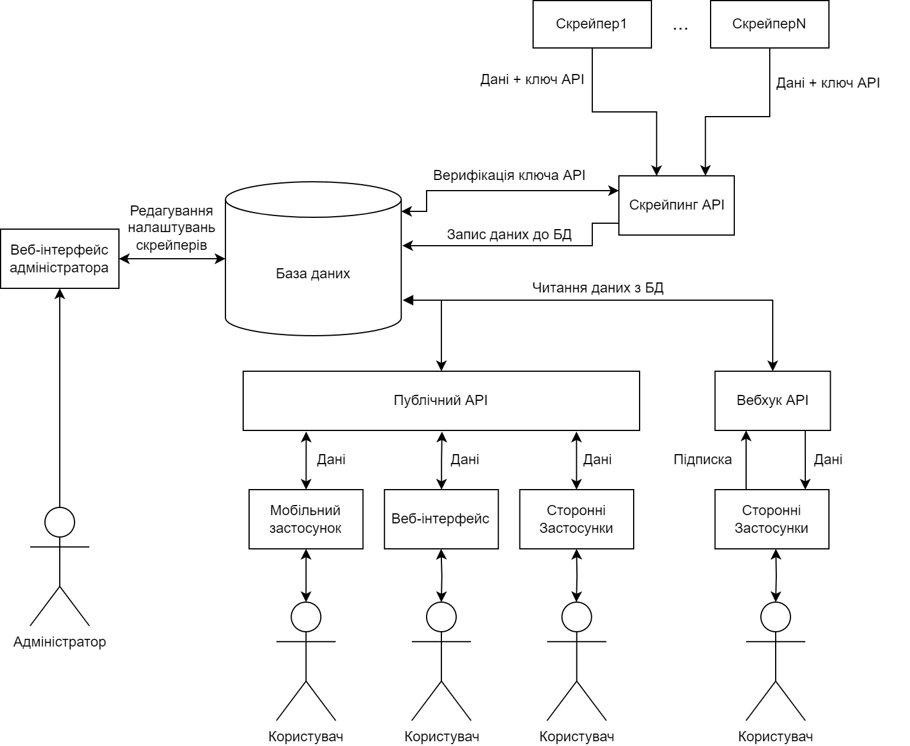
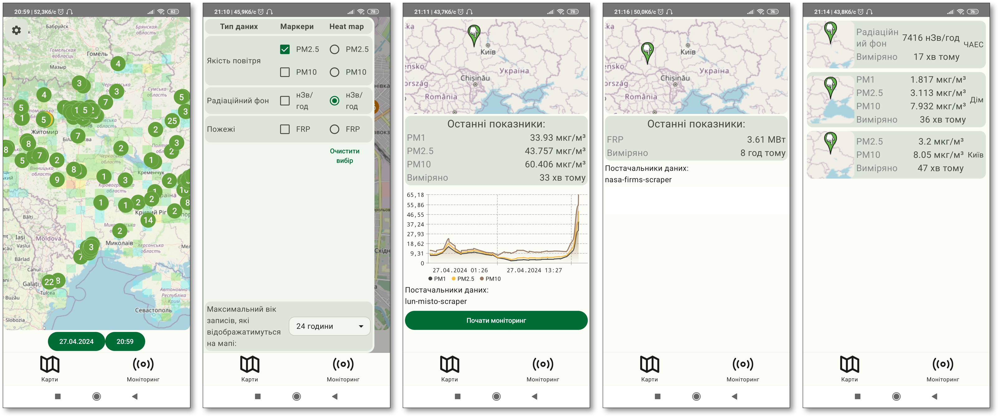
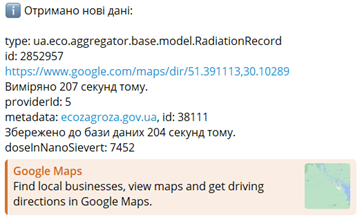
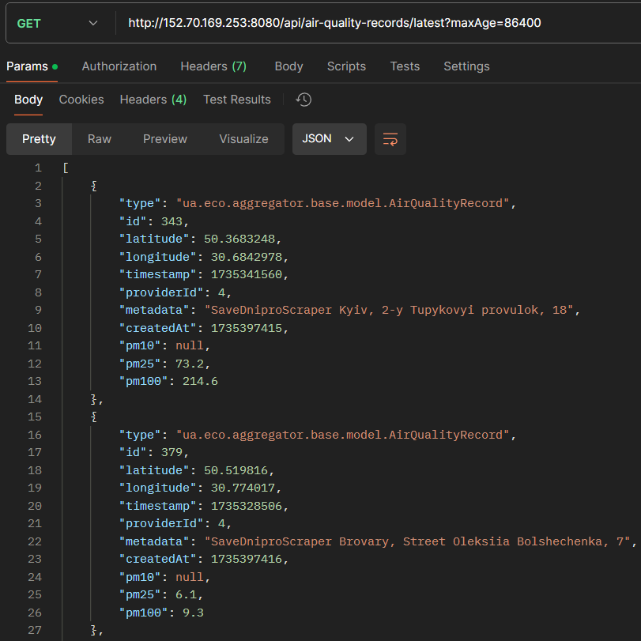

## 🌍 Агрегатор публічних екологічних даних України
Система для збору публічних екологічних даних з різних українських та міжнародних джерел. Проєкт збирає дані про якість повітря, рівні радіаційного фону та пожежі по всій Україні, роблячи їх доступними через уніфіковані публічні інтерфейси.



## 📊 Джерела даних

1. [LUN Misto Air](https://lun.ua/misto/air) - дані про якість повітря
2. [SaveDnipro](https://www.savednipro.org/product-category/monitoring-yakosti-povitrya/) – дані про якість повітря
3. [Sensor.community](https://sensor.community/) – дані про якість повітря
4. [meteo.gov.ua](https://www.meteo.gov.ua/ua/Situaciya-na-punktakh-sposterezhennya) – дані про радіаційний фон
5. [eco-zagroza.gov.ua](https://eco-zagroza.gov.ua) - дані про радіаційний фон
6. [NASA FIRMS](https://firms.modaps.eosdis.nasa.gov/) – дані про пожежі

## Необхідна інфраструктура для запуску

Проєкт модульний, складається з компонентів, які представлені у вигляді Docker-контейнерів для зручності розгортання. Для успішного запуску потрібно лише:

1. База даних **Oracle Database**

## Налаштування перед запуском

1. **Відредагуйте `compose.yaml` для налаштування середовища:**
    - `DB_CONNECTION_STRING` – рядок підключення до бази даних.
    - `DB_USER` і `DB_PASS` – облікові дані бази даних.
    - `UAECOAGGREGATOR_USERNAME` і `UAECOAGGREGATOR_PASSWORD_HASH` – логін і SHA-512 хеш пароля адміністратора для Admin API.

2. *(Опціонально)* **API ключ NASA FIRMS**:
   - Зареєструйтеся на [NASA FIRMS](https://firms.modaps.eosdis.nasa.gov/api/map_key/) і отримайте ключ для API.
   - Додайте ключ до `compose.yaml` (`FIRMS_API_KEY`).

3. *(Опціонально)* **Оптимізація періодів опитування:**
    - `POLLING_DELAY_IN_SECONDS` – налаштуйте для кожного скрейпера в залежності від потреб.

## Запуск

1. **Запустіть проєкт через Docker Compose:**
   ```bash
   docker compose up -d
   ```

2. **Переконайтеся, що всі сервіси запущені успішно:**
   ```bash
   docker compose stats
   ```
    - `webhook-api`
    - `public-api`
    - `admin-api`
    - `scraper-api`
    - Скрейпери для кожного джерела

## Структура проєкту

1. **Скрейпери** – збирають дані з джерел і передають їх до Scraping API.
2. **Scraping API** – приймає зібрані дані та записує їх до бази даних.
3. **Admin API** - надає веб-інтерфейс для налаштування скрейперів.
4. **Public API** – забезпечує доступ до зібраних даних через REST API.
5. **Webhook API** – дозволяє отримувати дані через вебхуки в режимі реального часу.

## Приклади використання

1. **Android-застосунок:**
    - Використовує `Public API`.
    - Дані подаються в зручній для звичайних користувачів формі (карти, графіки).



2. **Telegram-бот:**
    - Реалізує основні можливості `Webhook API`.



3. **REST API Public API:**
    - [Swagger UI](http://152.70.169.253:8080/swagger)
    - Надає доступ до даних для сторонніх застосунків або користувачів.
    - Приклад запиту для отримання останніх даних про якість повітря: 




---

## Автор

- **Воловик Олександр Андрійович**, група ІМ-41мп